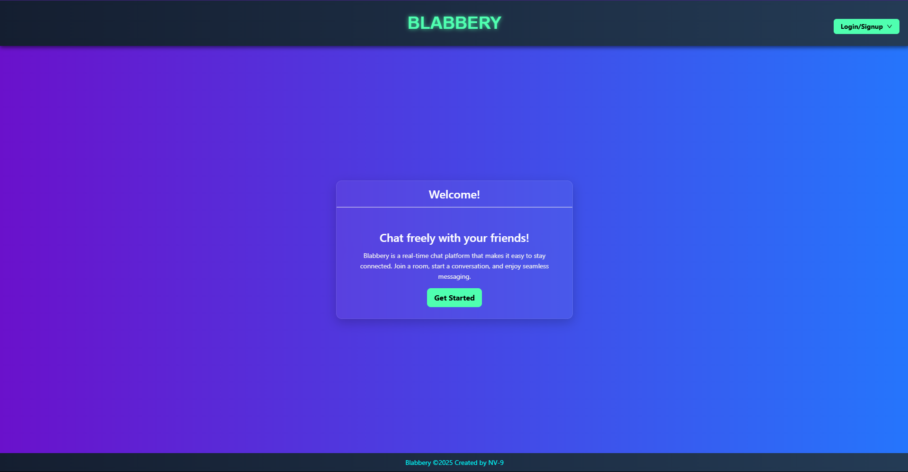
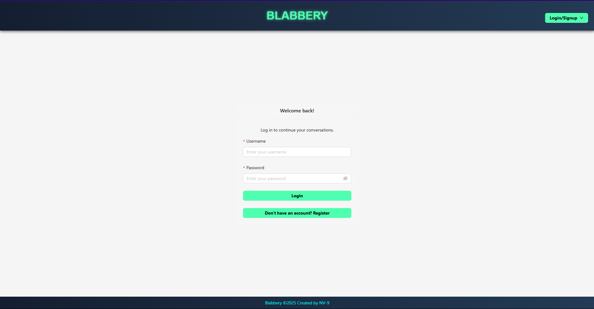
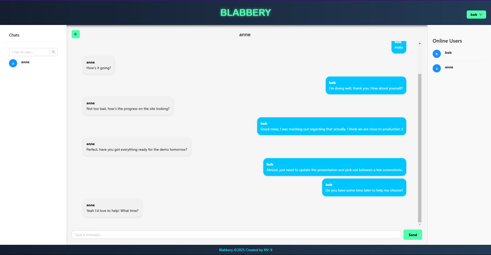

# blabbery
Blabbery is a modern, scalable chat application built with real-time messaging, user authentication, and group management features. Designed to be production-ready, it includes modular backend APIs, WebSocket integration for live communication, and a polished frontend interface.

This project is structured for reusability and rapid deployment, making it ideal for teams or individuals looking to implement real-time features into their platform with minimal setup.

## Built with
[](https://reactjs.org/)
[](https://vitejs.dev/)
[](https://ant.design/)
[](https://www.djangoproject.com/)
[](https://www.django-rest-framework.org/)
[](https://channels.readthedocs.io/)
[](https://postgresql.org)
[](https://redis.io/)
[](https://www.docker.com/)

## Features
- ✅ Realtime messaging (WebSockets via Django Channels)
- ✅ Direct & group chats
- ✅ Online/offline user tracking
- ✅ Message history and live sync
- ✅ Invite-only and public group joining
- ✅ Custom backend API and authentication
- ✅ Clean Ant Design interface
- ✅ Production-ready Docker config

## Live Demo
Check out the live version of Blabbery here: [https://blabbery.viswamedha.com](https://blabbery.viswamedha.com)

## Screenshots




## Roadmap
- [x] Chat via WebSocket
- [x] Online/offline presence
- [x] Group invitations
- [ ] API Hardening 
- [ ] Media uploads
- [ ] Mobile Interface
- [ ] Reactions & typing indicators
- [ ] Push notifications

## Development Philosophy
Blabbery is a showcase of good fullstack architecture, balancing real-time systems with database integrity and user experience. It's ideal for anyone wanting to fork and build out a more feature-rich messaging product without starting from scratch. If you have further suggestions, please reach out, always happy to learn. :)

## Run Locally

### Option 1: Docker
Use the following commands to spin up a docker container for an instant development environment.    
Bash:
```bash
git clone https://github.com/NV-9/Blabbery.git
cd blabbery
cp .env.template .env # or `copy .env.template .env` on Windows
docker compose -f docker-compose.dev.yml up -d --build
```
Open [http://localhost:8000](http://localhost:8000) in your browser to access the site.

---

### Option 2: Manual Setup

I personally would not recommend manual setup for testing features as it will take longer and is prone to errors.
The .env file will need to be customised with your specific setup and all services must be configured before using certain features.

#### Requirements
- Python ≥ 3.10  
- Node.js + npm  
- PostgreSQL  
- Redis  

#### Setup

On the first terminal, do as follows: 
```bash
git clone https://github.com/NV-9/Blabbery.git
cd Blabbery
python -m venv env
source env/bin/activate  # or `env\Scripts\activate` on Windows
pip install -r requirements\dev.txt
cp .env.example .env # Configure it for your setup
python manage.py migrate
python manage.py createsuperuser
```

Start the backend on the first terminal:
```bash
python manage.py runserver
```

Start the frontend on the second terminal:
```bash
cd front/web/
npm install
npm run build # Allows the backend server to have a set of built files
npm run dev # or `npm run watchdev` for getting build files similr to "HMR" 
```

Open [http://localhost:8000](http://localhost:8000) in your browser to access the backend and [http://localhost:5173](http://localhost:5173) for the frontend.


## 🧑‍💻 Contributing

Contributions are welcome! If you’d like to help improve **Blabbery**, follow these steps:

1. **Fork** the repository  
2. **Create** a new branch:  
   ```bash
   git checkout -b feature/your-feature-name
   ```
3. **Commit** your changes:  
   ```bash
   git commit -m "Add some feature"
   ```
4. **Push** to the branch:  
   ```bash
   git push origin feature/your-feature-name
   ```
5. **Open a Pull Request**

Please ensure your code adheres to the existing style and includes relevant tests where applicable.

If you're unsure where to start, check the [issues](https://github.com/NV-9/Blabbery/issues) section for bugs or features labeled `good first issue`.

---

## License

This project is licensed under the [GNU GPL3 license](./LICENSE)

> Blabbery is open-source and production-ready — use it, learn from it, or fork it to build something amazing.
